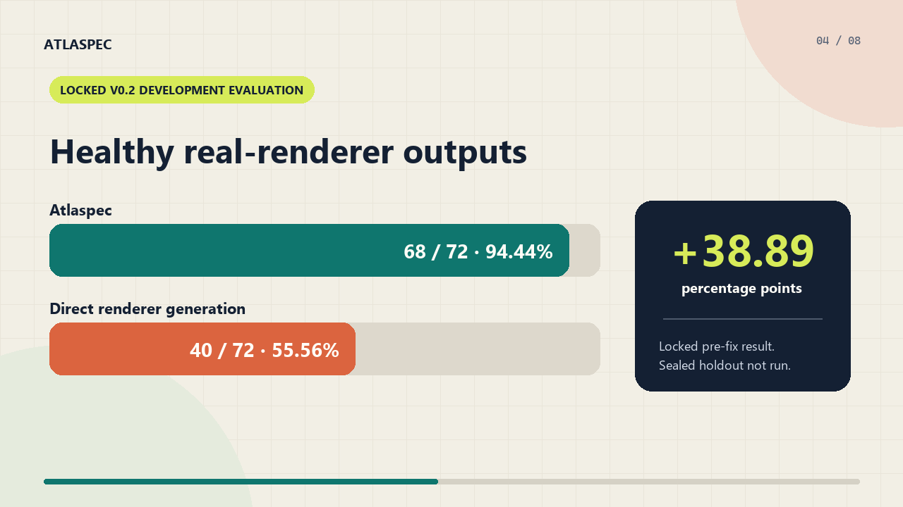
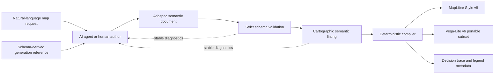

<div align="center">

# Atlaspec

### Intent-first map specifications for reliable AI-generated cartography

Atlaspec lets an agent describe **what a map should communicate** while a
deterministic compiler decides **how the renderer should implement it**.

[](#project-status)
[](CHANGELOG.md)
[](https://github.com/tauptlab/atlaspec/releases)
[](#current-document-version-02)
[](https://tauptlab.github.io/atlaspec/)
[](package.json)
[](src)
[](LICENSE)

**Semantic YAML in. Deterministic, renderer-valid map artifacts out.**

[Live Compiler Lab](https://tauptlab.github.io/atlaspec/) ·
[60-second demo](media/atlaspec-60s-demo.mp4) ·
[Getting started](#quick-start) ·
[Evidence](#evidence-so-far) ·
[Roadmap](docs/ROADMAP.md) ·
[Contributing](CONTRIBUTING.md)

</div>

> [!IMPORTANT]
> Atlaspec 0.2 is the latest document version and `0.2.0-rc.1` is the current
> research package candidate. Version 0.1 remains fully supported for
> compatibility. Stable `0.2.0` is intentionally withheld until the locked
> release contract is complete. The candidate is distributed as a GitHub
> prerelease and has not been published to npm.

## Try the live Compiler Lab

Open the [Atlaspec Compiler Lab](https://tauptlab.github.io/atlaspec/) to
inspect compiler-generated examples of semantic rejection, normalized
choropleth compilation, and area-proportional symbol policy.

The page displays a checked snapshot generated by the repository compiler; it
does not execute an LLM or replace the authoritative CLI. It also reports the
12-task local holdout separately from the v0.2 development diagnostic. See
[`demo/README.md`](demo/README.md) for the exact boundary and reproduction
steps.

## Watch the 60-second overview

[](media/atlaspec-60s-demo.mp4)

The video is designed for silent autoplay and ships with a separate
[caption track](media/atlaspec-60s-demo.srt). Its headline evidence is the
one-time local holdout: `120/120` accepted Atlaspec outputs versus `108/120`
direct MapLibre outputs, a `+10 pp` difference with a 95% interval of
`+3.3 to +18.3 pp`. See the
[launch-video notes](docs/LAUNCH_VIDEO.md) for the storyboard and reproducible
renderer.

## Why Atlaspec exists

Modern coding agents can write MapLibre or Vega-Lite, but renderer-native map
configuration has a large and brittle generation surface. A model must get
layer types, expressions, sources, scales, legends, missing-value behavior,
zoom rules, and accessibility choices right at the same time. A syntactically
plausible output can still be invalid or cartographically misleading.

Atlaspec moves those decisions across a trust boundary:

| The agent specifies | Atlaspec verifies or derives |
|---|---|
| map-reading intent and audience | strict document structure |
| field measurement and semantic types | valid field/source relationships |
| geometry and visual channel intent | renderer expressions and layer types |
| mandatory constraints | palettes, domains, symbol-area scales, and legends |
| semantic zoom behavior | MapLibre sources, filters, and zoom configuration |

This is more than a shorter syntax. It reduces the amount of renderer-specific
code an agent must invent and replaces it with versioned validation and
deterministic compilation.

During the frozen local holdout, direct MapLibre outputs failed because they
embedded source objects where source IDs were required, nested `zoom`
expressions illegally, used data expressions in unsupported properties, or
produced invalid text offsets. Atlaspec exposed none of those authoring
surfaces to the model, and all Atlaspec outputs compiled successfully.

## Evidence so far

Atlaspec has two complementary evidence tracks. They answer different
questions and should not be combined into one headline score.

### Frozen v0.1 holdout: generation reliability and efficiency

The one-time local holdout contains 12 tasks across four map families and three
difficulty levels. Each task-condition-agent tuple was run five times with
balanced condition order.

| Local agent | Direct MapLibre | Atlaspec | Yield delta | Output-token reduction |
|---|---:|---:|---:|---:|
| Codex CLI 0.144.4 | 54/60 (90%) | **60/60 (100%)** | **+10 pp** | **77.3% lower** |
| Claude Code 2.1.17 | 54/60 (90%) | **60/60 (100%)** | **+10 pp** | **59.4% lower** |

- 450/450 planned runs completed across six independently verified shards.
- The 95% confidence interval for the yield delta was **+3.3 to +18.3
  percentage points** for each agent.
- The output-token reduction intervals were **74.1–80.5%** for Codex and
  **51.2–66.9%** for Claude.
- Atlaspec and Atlaspec-repair both achieved 60/60 first-attempt acceptance for
  each agent; no repair call was needed.
- Claude's reported charge per accepted map was 38.0% lower and latency per
  accepted map was 51.6% lower. Codex latency was 63.9% lower, but its monetary
  charge was unavailable.

Read the immutable evidence and limitations in the
[holdout result](docs/LOCAL_HOLDOUT_2026-07-20.md), its
[pre-execution lock](docs/LOCAL_HOLDOUT_LOCK_2026-07-20.md), and the
[benchmark contract](docs/BENCHMARK.md). The holdout is consumed and must not
be used to tune Atlaspec 0.1 or run a second confirmation.

### Locked v0.2 development evaluation: real renderer health

The v0.2 evaluation replays preserved Claude and Codex outputs through real
MapLibre and Vega runtimes. Preregistered gates check visible geometry, label
coverage and pixels, placement boxes, clipping, duplicates, and sampled
label-to-point-symbol occlusion.

| Development result | Direct renderer generation | Atlaspec | Difference |
|---|---:|---:|---:|
| Locked pre-fix verdict | 40/72 (55.56%) | **68/72 (94.44%)** | **+38.89 pp** |
| Post-fix engineering replay | 40/72 (55.56%) | **72/72 (100%)** | **+44.44 pp** |

The locked verdict found four real Atlaspec proportional-label failures. A
post-failure 2 x 2 ablation reproduced all four and showed that either a wider
declared range or 3 em maximum-radius label clearance removed the observed
occlusion. Atlaspec adopted the clearance policy because it preserves the
authored data domain. The 72/72 replay verifies the repair on these preserved
outputs; it is **post-selected remediation evidence**, not a new unbiased
benchmark estimate.

Read the [locked occlusion result](docs/V02_OCCLUSION_RENDER_2026-07-23.md),
the [controlled ablation](docs/V02_OCCLUSION_ABLATION_RND_2026-07-23.md), and
the [post-fix replay](docs/V02_OCCLUSION_POSTFIX_2026-07-23.md). The fresh v0.2
holdout remains sealed.

### What the evidence supports

> In the tested local-agent tasks, asking an agent to author a constrained
> semantic map specification and delegating renderer details to a deterministic
> compiler produced more accepted outputs, substantially fewer output tokens,
> and more healthy real-renderer artifacts than direct renderer-native
> generation.

These results do not yet establish universal model generalization, human
map-reading accuracy, blind cartographer preference, or production readiness.
Codex uncached tokens per accepted v0.1 map were 0.9% worse despite its much
smaller output, and absolute token counts are not compared between Codex and
Claude because their CLI accounting and cache semantics differ. Hosted model
strata, unseen v0.2 confirmation, semantic-priority checks, local-background
contrast, and human evaluation remain open.

The current evidence also does **not** compare Atlaspec against the strongest
practical direct-authoring baseline: official renderer validation followed by
an equal diagnostic repair opportunity. That symmetric baseline and the
precommitted component ablations remain required before attributing the
observed improvement specifically to the language, linter, or compiler.

## How it works



The compiler records every inferred decision—such as palette, domain, symbol
scale, basemap, or clustering—in `metadata["atlaspec:decisions"]`. Generated
styles also retain the original intent and a machine-readable legend
descriptor. Identical Atlaspec input and compiler versions produce identical
renderer decisions.

## Quick start

Atlaspec currently runs from a source checkout and requires Node.js 20 or
newer.

```powershell
npm install
npm run check
```

Validate an example:

```powershell
npm run atlaspec -- validate examples/flood-risk.atlas.yaml
```

```text
VALID .../examples/flood-risk.atlas.yaml
```

Compile it to a MapLibre style:

```powershell
npm run atlaspec -- compile examples/flood-risk.atlas.yaml `
  --output flood-risk.style.json
```

The resulting JSON is a MapLibre Style Specification v8 document that can be
passed to a MapLibre map as its `style`.

## An Atlaspec document

The following is a shortened but valid choropleth specification. The agent
declares that `flood_probability` is a normalized probability; it does not
write a MapLibre color expression, palette array, legend object, or missing-
value filter.

```yaml
version: "0.1"
map: flood-risk
title: Flood risk by district
family: choropleth

intent:
  task: compare
  audience: general-public
  primary_message: Identify districts with the highest flood probability.

data:
  sources:
    - id: districts
      type: geojson
      url: ./data/districts.geojson
  fields:
    flood_probability:
      source: districts
      path: flood_probability
      measurement: quantitative
      semantic_type: probability
      unit: ratio
      normalization: ratio
      range: [0, 1]

encoding:
  geometry: {source: districts, support: polygon}
  color: {field: flood_probability, classification: continuous}

constraints:
  colorblind_safe: true
  missing_data: explicit
  raw_count_choropleth: reject
  viewport: {width: 960, height: 640}

basemap: {style: minimal-light, contrast: light}
```

The compiled style includes an auditable explanation of inferred renderer
choices:

```json
{
  "atlaspec:legend": {
    "field": "flood_probability",
    "semantic_type": "probability",
    "unit": "ratio",
    "range": [0, 1]
  },
  "atlaspec:decisions": [
    {
      "code": "color.palette-inferred",
      "path": "/encoding/color",
      "reason": "probability semantics determine the default palette family."
    }
  ]
}
```

Complete runnable examples:

- [Flood-risk choropleth](examples/flood-risk.atlas.yaml)
- [Emergency-shelter proportional symbols](examples/shelter-capacity.atlas.yaml)
- [Multi-layer operations overview](examples/operations-overview.atlas.yaml)
- [Cross-renderer portable overview](examples/portable-overview.atlas.yaml)

## Current document version 0.2

Version 0.2 replaces the single top-level `family` and `encoding` with stable,
ordered semantic layers. Each layer has an ID, purpose, family, encoding,
missing-data policy, and optional behavior. Shared intent, data, viewport, and
basemap remain at document level.

The abbreviated shape below omits required source, field, and encoding details;
use the linked runnable examples as copyable input.

```yaml
version: "0.2"
map: response-overview
title: Flood risk and emergency facilities
intent:
  task: compare
  audience: operations
  primary_message: Compare district risk and locate response facilities.
data:
  sources: [] # declare GeoJSON sources
  fields: {}  # declare semantic fields
layers:
  - id: flood-risk
    purpose: primary
    family: choropleth
    encoding: {}
  - id: facilities
    purpose: supporting
    family: categorical-point
    encoding: {}
```

The MapLibre compiler supports all four families in authored draw order and
names generated renderer layers as `{map}-{layer}-{role}`. The Vega-Lite v6
target supports the portable static subset: choropleths, proportional symbols,
categorical points, and point labels. It fails with capability diagnostics for
heatmap kernels, clustering, semantic zoom, and unsupported non-point labels;
requirements are never silently dropped.

Upgrade a 0.1 document without modifying the source file:

```powershell
npm run atlaspec -- upgrade examples/flood-risk.atlas.yaml `
  --output flood-risk.v02.atlas.yaml
```

Compile or inspect renderer support:

```powershell
npm run atlaspec -- compile examples/portable-overview.atlas.yaml `
  --target maplibre --output portable.maplibre.json

npm run atlaspec -- compile examples/portable-overview.atlas.yaml `
  --target vega-lite --output portable.vegalite.json

npm run atlaspec -- capabilities examples/operations-overview.atlas.yaml `
  --target vega-lite
```

The schema, migration, MapLibre composition, Vega-Lite subset, compatibility
fixtures, and real-renderer evaluation path are implemented. In the latest
post-hardening qualification, Claude passed every locked development gate.
Codex passed reliability, output-token, edit-survival, portability, and
capability fail-closed gates but missed the 25% total uncached-token reduction
gate with a measured 3.21% reduction. The deterministic evaluator passes all
214 declared conditions with zero model calls, and the latest locked visual
result is 68/72 healthy Atlaspec outputs versus 40/72 direct outputs.

Version 0.2 is therefore the recommended format for new multi-layer work, but
the package remains a research release candidate. The fresh holdout stays
sealed under the precommitted contract. See the
[post-hardening qualification](docs/V02_POST_HARDENING_QUALIFICATION_2026-07-21.md),
[v0.2 scope](docs/SCOPE_0.2.md),
[evaluation contract](docs/BENCHMARK_0.2.md), and
[48-task matrix](benchmark/v02/README.md).

## Versioning and compatibility

Atlaspec document versions and package versions are related but distinct:

| Contract | Current value | Meaning |
|---|---|---|
| Latest document version | `0.2` | recommended for new documents |
| Supported legacy document | `0.1` | validation and MapLibre compatibility retained |
| Package version | `0.2.0-rc.1` | installable release candidate, not stable |

The public API exports `LATEST_ATLASPEC_DOCUMENT_VERSION`,
`SUPPORTED_ATLASPEC_DOCUMENT_VERSIONS`, and `ATLASPEC_PACKAGE_VERSION`.
See the [changelog](CHANGELOG.md) for the current package boundary.

## Legacy version 0.1 compatibility

| Family | Geometry | Required encoding | Key semantic protection |
|---|---|---|---|
| Choropleth | polygon | ordered `color` field | raw counts rejected by default |
| Proportional symbol | point | quantitative `size` field | symbol area is proportional to value |
| Categorical point | point | nominal `category` field | explicit domain and safe palette |
| Heatmap | point or grid | optional ordered `weight` field | concentration remains distinct from magnitude |

Supported intent includes locate, compare, rank, distribution, and distinguish.
Fields declare a measurement level—nominal, ordinal, quantitative, or
temporal—and a semantic type such as category, count, rate, probability,
delta, rank, capacity, uncertainty, identifier, or label.

See the complete [0.1 scope](docs/SCOPE.md). Routing, spatial analysis, tile
production, raster processing, navigation, 3D terrain, and application UI are
deliberate non-goals. Atlaspec complements GeoJSON, MapLibre, and Vega-Lite; it
does not replace them.

Earlier deterministic routing, shadow, and visibility prototypes are preserved
under [`experiments/spatial-analysis`](experiments/spatial-analysis) as a
separate research exploration. They are not Atlaspec 0.2 capabilities and are
not part of the public compiler demo or renderer benchmark.

## Validation and diagnostics

Validation is fail-closed and has two stages:

1. strict schema validation rejects unknown keys, invalid types, and unsupported
   enum values;
2. semantic linting rejects misleading or inconsistent cartography.

Diagnostics have stable, grep-friendly codes and JSON Pointer paths. Examples
include:

- `choropleth.raw-count` for an unnormalized raw-count choropleth;
- `field.probability-range` for a probability outside `[0, 1]`;
- `encoding.cross-source-field` for an encoding bound to another source;
- `behavior.invalid-zoom-range` for contradictory semantic zoom bounds;
- `family.geometry-mismatch` for a family/geometry incompatibility.

Machine-readable validation is available for agents and CI:

```powershell
npm run atlaspec -- validate examples/shelter-capacity.atlas.yaml --json
```

A non-valid document exits non-zero. Compilation also refuses to emit a style
when any error diagnostic remains.

## CLI reference

| Command | Purpose |
|---|---|
| `npm run atlaspec -- validate <file>` | validate YAML or JSON and print diagnostics |
| `npm run atlaspec -- validate <file> --json` | emit a machine-readable validation report |
| `npm run atlaspec -- compile <file>` | compile to MapLibre and write JSON to stdout |
| `npm run atlaspec -- compile <file> --target vega-lite` | compile the portable 0.2 subset to Vega-Lite |
| `npm run atlaspec -- compile <file> -o <artifact.json>` | write the renderer artifact to a file |
| `npm run atlaspec -- upgrade <file> [-o <file>]` | convert 0.1 to canonical 0.2 YAML |
| `npm run atlaspec -- capabilities <file> --target <target>` | report target support and fail-closed diagnostics |
| `npm run atlaspec -- --help` | show all available commands |

After `npm run build`, the compiled CLI entry point is `dist/cli.js`. The
`atlaspec` binary declaration is already present for a future package release.

## Programmatic API

```ts
import { writeFile } from 'node:fs/promises';
import { compileMapLibre, loadDocument } from 'atlaspec';

const document = await loadDocument('maps/flood-risk.atlas.yaml');
const result = compileMapLibre(document);

if (!result.ok) {
  for (const diagnostic of result.diagnostics) {
    console.error(diagnostic.code, diagnostic.path, diagnostic.message);
  }
  process.exitCode = 1;
} else {
  await writeFile(
    'maps/flood-risk.style.json',
    `${JSON.stringify(result.style, null, 2)}\n`,
  );
  console.log(result.decisions);
}

```

The package exports the TypeBox schemas, inferred TypeScript types, document
loader/parser, validator, linter, migration helpers, MapLibre and Vega-Lite
compilers, diagnostics, decision records, and compiled artifact types from
[src/index.ts](src/index.ts).

## Using Atlaspec with an AI agent

The benchmark generation reference is produced from the live schema rather
than maintained as a separate handwritten grammar:

```powershell
npm run reference:atlaspec:generate
npm run reference:atlaspec:check
```

Give [benchmark/references/atlaspec.md](benchmark/references/atlaspec.md) to the
agent alongside the map request and GeoJSON. Ask for exactly one Atlaspec YAML
document. Validate the response, return stable diagnostics if it fails, and
compile only after validation succeeds.

This reference-driven workflow matters: early development measurements exposed
agent-specific failures caused by omitted enum and collection-shape details.
Generating the reference from the actual schema closed that drift and led to
120/120 accepted Atlaspec holdout generations across the two local agents.

## Benchmarking and reproducibility

Atlaspec is benchmark-first. Failed generations remain in the denominator, and
automated checks validate real renderer output rather than accepting a model's
description of its own success.

Run the deterministic compiler smoke benchmark:

```powershell
npm run benchmark:smoke
```

Verify the frozen 48-task corpus and generated agent reference:

```powershell
npm run corpus:check
npm run reference:atlaspec:check
```

The comparative harness supports direct MapLibre, direct Vega-Lite, Atlaspec,
and Atlaspec with one repair opportunity. It records prompts, raw outputs,
digests, resolved model identities, tokens, charges when available, latency,
tool calls, validation checks, compiler commits, and every failed attempt.

Start with:

- [AtlasBench harness](benchmark/README.md)
- [Generation adapter contract](benchmark/ADAPTER.md)
- [Benchmark and success gates](docs/BENCHMARK.md)
- [Official raw-API runbook](docs/OFFICIAL_BENCHMARK_RUNBOOK.md)
- [Initial failed local qualification](docs/LOCAL_QUALIFICATION_2026-07-20.md)
- [Post-fix R&D](docs/LOCAL_POSTFIX_RND_2026-07-20.md)
- [One-time local holdout result](docs/LOCAL_HOLDOUT_2026-07-20.md)
- [AtlasBench 0.2 local qualification](docs/V02_LOCAL_QUALIFICATION_2026-07-20.md)
- [AtlasBench 0.2 multi-task qualification](docs/V02_MULTI_TASK_QUALIFICATION_2026-07-21.md)
- [AtlasBench 0.2 post-qualification R&D](docs/V02_POST_QUALIFICATION_RND_2026-07-21.md)
- [AtlasBench 0.2 reference-hardening matrix R&D](docs/V02_REFERENCE_HARDENING_MATRIX_RND_2026-07-21.md)
- [AtlasBench 0.2 post-hardening qualification and token-feasibility R&D](docs/V02_POST_HARDENING_QUALIFICATION_2026-07-21.md)
- [AtlasBench 0.2 compact-reference R&D](docs/V02_COMPACT_REFERENCE_RND_2026-07-21.md)
- [AtlasBench 0.2 reference-layout A/B R&D](docs/V02_REFERENCE_LAYOUT_AB_RND_2026-07-21.md)
- [AtlasBench render-evidence contract](docs/RENDER_EVIDENCE.md)
- [AtlasBench 0.2 Vega-Lite render-health evidence](docs/V02_RENDER_HEALTH_2026-07-22.md)
- [AtlasBench 0.2 cross-renderer health evidence](docs/V02_CROSS_RENDERER_HEALTH_2026-07-22.md)
- [AtlasBench 0.2 MapLibre label-gate lock](docs/V02_LABEL_GATE_LOCK_2026-07-22.md)
- [AtlasBench 0.2 label-aware cross-renderer evidence](docs/V02_LABEL_AWARE_RENDER_2026-07-22.md)
- [AtlasBench 0.2 placed-label geometry gate lock](docs/V02_PLACEMENT_GEOMETRY_GATE_LOCK_2026-07-23.md)
- [AtlasBench 0.2 placed-label geometry evidence](docs/V02_PLACEMENT_GEOMETRY_RENDER_2026-07-23.md)
- [AtlasBench 0.2 label-to-point-symbol occlusion gate lock](docs/V02_OCCLUSION_GATE_LOCK_2026-07-23.md)
- [AtlasBench 0.2 label-to-point-symbol occlusion evidence](docs/V02_OCCLUSION_RENDER_2026-07-23.md)
- [AtlasBench 0.2 proportional-label occlusion ablation R&D](docs/V02_OCCLUSION_ABLATION_RND_2026-07-23.md)
- [AtlasBench 0.2 proportional-label post-fix evidence](docs/V02_OCCLUSION_POSTFIX_2026-07-23.md)

The local automated pass is intentionally narrower than the complete benchmark
contract. AtlasBench can export non-empty SVG evidence for Vega-Lite and
offline browser PNG evidence with locally rendered MapLibre labels. It measures
candidate-backed label coverage, duplicates, label-only pixels, and sampled
viewport-edge pixels against preregistered variant-specific gates. This still
does not substitute for human accuracy, expert review, hosted-model
reproduction, or comprehensive visual-quality evaluation.

## Repository map

```text
src/                    schemas, migration, validation, linting, and compilers
examples/               runnable Atlaspec documents and local GeoJSON
benchmark/              AtlasBench harness, adapters, references, and corpus
benchmark/corpus/       frozen 36-development / 12-holdout task matrix
benchmark/v02/          locked v0.2 matrix, datasets, evaluator, and model runner
docs/                   scope, benchmark contracts, runbooks, and evidence
```

## Project status

Atlaspec remains pre-alpha research software. Document version 0.2 is now the
latest supported format, and package `0.2.0-rc.1` is the current release
candidate. It includes the layered schema, guarded migration, multi-layer
MapLibre compiler, portable Vega-Lite subset, capability inspection, localized
edit workflow, and browser-backed visual gates. Version 0.1 remains supported
through explicit schema, type, migration, and frozen compiler contracts.

The strongest current claims and their boundaries are summarized in
[Evidence so far](#evidence-so-far). The v0.2 holdout remains sealed, so stable
`0.2.0` has not been declared and current results remain development
qualification and remediation evidence.

Work still required before a stable release includes:

- hosted raw-API reproduction across pre-committed model strata;
- deterministic local-background contrast and label-priority gates;
- blind human map-reading and cartographer review;
- larger edit-survival and feature-ablation studies;
- package publication and a stable compatibility policy;
- one-time execution of the sealed v0.2 holdout after development gates pass.

Active v0.2 work is governed by the pre-implementation
[v0.2 scope](docs/SCOPE_0.2.md) and
[AtlasBench 0.2 contract](docs/BENCHMARK_0.2.md). It focuses on multi-layer
composition, v0.1 compatibility, Vega-Lite portability, and localized edit
survival using a new benchmark corpus.

## Contributing

Atlaspec welcomes focused issues and pull requests, especially around semantic
validation, cartographic failure cases, compiler determinism, renderer-valid
output, and reproducible evaluation.

Read [CONTRIBUTING.md](CONTRIBUTING.md) for the complete workflow,
[SECURITY.md](SECURITY.md) for private vulnerability reporting, and
[SUPPORT.md](SUPPORT.md) for support routing. Research users can cite the
software using [CITATION.cff](CITATION.cff).

Before submitting a change:

```powershell
npm install
npm run check
npm run build
```

`npm run check` runs TypeScript checking, all tests, frozen corpus integrity,
and generated-reference freshness. Benchmark thresholds and holdout results are
project contracts: changes must be explicit and must never be made merely to
fit an observed result.

See the public [roadmap](docs/ROADMAP.md) for the evidence required before a
stable release and production-shaped adoption.

## License

[MIT](LICENSE) © 2026 Atlaspec contributors
